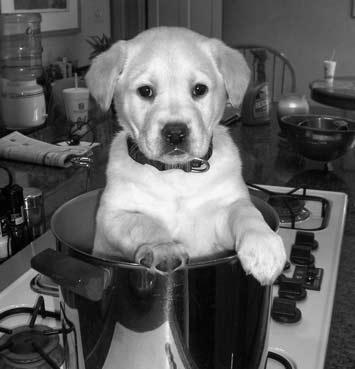

# Noise Removal in MATLAB

 

This project is part of the university coursework for the third-year module "Image Analysis." The goal is to explore and implement various image processing methods to remove noise from a distorted image and compare the results with the original image.

## Overview

- **Course:** Image Analysis (Third-Year Module)
- **Language:** MATLAB

## Project Description

The project involves the following key steps:

1. **Input Images:**
   - Original Image: `dogOriginal.bmp`
   - Distorted Image: `dogDistorted.bmp`

2. **Noise Removal Methods:**
   - Implement different image processing methods to reduce noise in the distorted image.

3. **Performance Evaluation:**
   - Compare the processed image with the original using Mean Squared Error (MSE).
   - Display the original and processed images for visual inspection.

## Usage

To run the MATLAB code:

1. Open MATLAB.
2. Load the project files.
3. Run the main script for noise removal.
